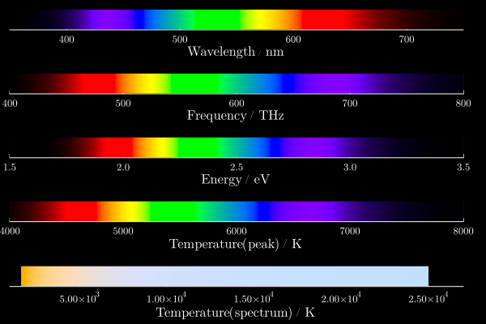

# UnitfulColors
Adds `colormatch` functions for several unitful quantities, giving XYZ approximations of

* EM radiation with a given vacuum wavelength
* EM radiation with a given frequency
* Photons with a given energy
* Black body radiators with a given temperature

## Examples

